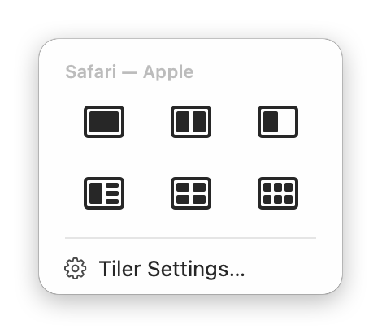
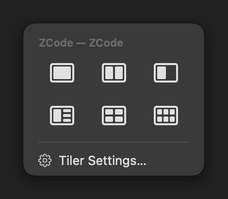
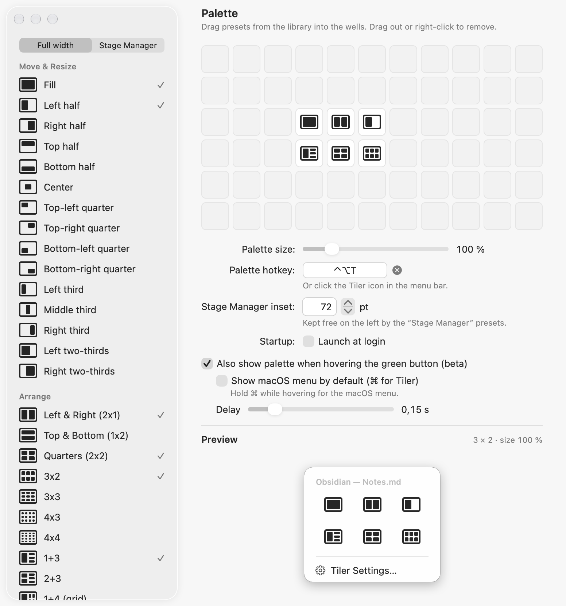

# Tiler

A native **macOS window manager** that lives in the menu bar — a fast, personal
[Moom](https://manytricks.com/moom/) alternative built with **Swift 6** and the **Accessibility
API**. Click the Tiler icon in the menu bar (or press ⌃⌥T) and a palette of layouts drops
down: move and resize the front window, or arrange every window on the screen into grids and
splits. No Dock icon, no background daemons, no configuration files to hand-edit.

| Palette (light) | Palette (dark) | Settings |
|---|---|---|
|  |  |  |

## Highlights

- **28 move & resize presets + 28 arrange layouts** — halves, thirds, quarters, 3×2–4×4
  grids, 1+3/2+3/1+4 splits; every layout in a full-width and a Stage-Manager variant.
- **Native macOS feel** — native-size palette at Apple's exact menu metrics, green-button
  hover trigger with the ⌘ rule, animated window glides, light and dark mode.
- **Full editor** — an 11×6 drag-and-drop palette grid with live glass preview, per-preset
  hotkeys, adjustable Stage Manager inset.
- **Quality bar** — 239-check live harness, pixel-measured native metrics, zero-warning
  Swift 6 build.

## First run

1. `scripts/install.sh` builds, signs, installs to `~/Applications/Tiler.app` and opens it.
2. The first build asks whether `codesign` may use the `ninja-codesign` key. Choose
   **Always Allow** (not just Allow), or every later build waits for that prompt.
3. Grant Accessibility: right-click the menu-bar icon › "Accessibility: missing — click to open
   Settings", then switch on Tiler in System Settings › Privacy & Security › Accessibility.
   Grant it to `~/Applications/Tiler.app` only, not to a copy in `out/`.
4. The icon (a rectangle with its left half filled) sits on the right of the menu bar. Click it
   for the palette, right-click it for the menu.
5. Or press ⌃⌥T to open the palette centered on the front window.

## Install

```sh
scripts/install.sh
```

This builds a release, copies it to `~/Applications/Tiler.app`, quits a running copy and opens
the new one. `scripts/build.sh` only builds and signs (`out/Tiler.app`). Add `--dev` to build
`out/dev/Tiler.app` with the bundle id `dev.ninja.tiler.dev` instead of `dev.ninja.tiler`.
Both scripts take `--scratch-path <dir>`; `build.sh` also takes `--out-dir <dir>`.
The app icon is `Resources/AppIcon.icns`, generated by `swift scripts/make-icon.swift` (procedural, CoreGraphics + `iconutil`) — rerun it after changing the design and commit the new `.icns`.

## Grant Accessibility (once)

Tiler moves windows through the Accessibility API. Right-click the menu-bar icon. If the menu
shows "Accessibility: missing — click to open Settings", click that line and switch Tiler on
in System Settings › Privacy & Security › Accessibility. Grant it to the installed copy in
`~/Applications` only.

## Use

- **Menu bar:** click the Tiler icon. The palette drops down under it and acts on the window
  that was in front. Right-click (or ⌃-click) the icon for the menu: Settings…, the
  Accessibility status, Pause Tiler, Quit Tiler. While paused, any click opens the menu.
- **Hotkey:** ⌃⌥T opens the palette centered on the front window. ←→↑↓ move the selection,
  Return applies it, 1–9 apply the n-th preset (row by row), Esc or ⌃⌥T again closes it.
- The header names the target window. With no window in front, single-window presets are
  dimmed; arrange presets still work on that screen.
- **Green-button hover (beta, off by default):** Settings › "Also show palette when hovering
  the green button". Then hovering a window's green button shows the palette under it. The
  **⌘ rule:** hold ⌘ while hovering to get Apple's own green-button menu instead;
  "Show macOS menu by default (⌘ for Tiler)" swaps the two. Clicking the green button itself
  still toggles full screen.

## Edit the palette

Right-click the menu-bar icon › Settings…, or the "Tiler Settings…" row in the palette. The
library on the left lists every preset; the "Full width / Stage Manager" switch above it shows
either width variant (Stage Manager presets keep the Stage Manager strip on the left free).
The Palette pane has 11 × 6 wells:

- Drag a preset from the library onto an empty well to add it. A preset that is already placed
  moves there instead (swapping with an occupied well).
- Drag a well onto another well to move it. Dropping it on an occupied well swaps the two.
- Drag a well anywhere outside the wells (onto the library, or out of the window) to remove it.
  Right-click › Remove works too.
- Revert (under "Other" in the library) is a well item like any preset: one tile, dimmed until
  there is a move to undo. New and updated configs get it left of the palette's top row once;
  drag it out to remove it for good.
- The palette is the bounding box of the occupied wells (shown in white in light mode, a
  lighter gray in dark mode). Empty wells inside that box become blank space.

Below the wells: palette size, the palette hotkey (click the field and press a new shortcut;
Esc cancels, ⌫ or ⓧ removes it), the Stage Manager inset, launch at login, and the hover
trigger with its ⌘ rule and delay. The live preview is the palette itself — header, tiles and
the "Tiler Settings…" footer, for a representative target — shrunk to fit only when it's too
large to show at its real size. Every change is saved at once to
`~/Library/Application Support/Tiler/config.json` and used by the next palette.

## Signing

`build.sh` signs with the self-signed certificate `ninja-codesign` whenever the keychain has it.
The Accessibility grant is tied to that certificate and the bundle id, so it survives rebuilds.
The keychain asks before `codesign` may use the key; choose "Always Allow" once, or every build
waits for that prompt. Without the certificate the app is signed ad hoc, and the script warns
you. In that case macOS forgets the grant after every rebuild, and you must grant it again.

## Debug flags

```sh
Tiler --config <path>                        # use another config file (tests never touch yours)
Tiler --show-settings                        # open Settings at launch
Tiler --render-palette out/palette.png [--dark] [--size 1.5] [--highlight <n>]
                       [--header "App — Window"] [--no-target] [--revert]
Tiler --render-editor out/editor.png [--dark]   # settings window, headless, 2×
```

The render flags draw headless 2× PNGs and exit. For `--render-palette`: `--highlight <n>`
shows the n-th preset (row by row, from 0) selected; `--header` sets the target line (default
"TilerTestWindows — TW1"); `--no-target` renders the "No window" state with single-window
presets dimmed; `--revert` renders with move history (a Revert well enabled, not dimmed).
